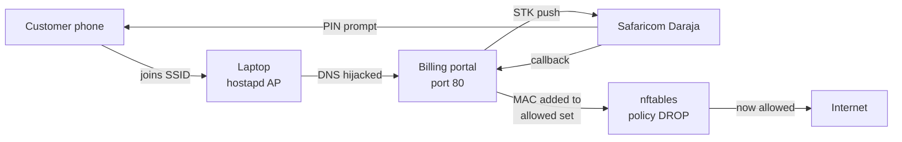

# Deploying Heziis WiFi — laptop as the hotspot

This turns your laptop into the thing that hands out WiFi and takes the money.
**Windows cannot do this** — its mobile hotspot cannot redirect unpaid customers,
and its firewall filters by IP address, never by device. Linux can, so the laptop
runs Ubuntu.

---

## 1. What you need

| Item | Why | Notes |
|---|---|---|
| **USB stick, 4 GB or bigger** | To boot the Ubuntu installer | The ISO is 3.15 GB, so a **4 GB stick works** with ~600 MB to spare. 8 GB is comfortable. |
| **Ethernet cable** | Brings in internet — the laptop's own WiFi radio is busy being the hotspot | Already loose? Any Cat5e cable will do |
| **The laptop** | Intel Wireless-AC 8260 — supports hotspot mode | Fine |
| **Airtel router** | Stays as-is, gives the laptop internet | **Turn its WiFi OFF**, or customers connect to it and never see the payment page |

Total extra spend: about the price of a USB stick — or nothing if you have one.

---

## 2. Write the USB stick

Plug the stick in, then in an **Administrator** PowerShell:

```powershell
cd c:\Users\f\Downloads\HeziisWifi

.\deploy\make-usb.ps1 -Download          # fetch Ubuntu (~3.1 GB, one time)
.\deploy\make-usb.ps1 -List              # confirm the stick and its DiskNumber
.\deploy\make-usb.ps1 -DiskNumber 2      # write it (2 = whatever -List showed)
```

The script shows you everything currently on the stick and makes you type the
disk number back before it erases anything. It also copies this project onto the
stick as `heziis-wifi.zip`, so the Linux side needs no `git`.

It compares your stick against the actual ISO size, so a **4 GB stick is
accepted** (a fixed "6 GB minimum" would have wrongly rejected it).

> If your stick is not detected at all, try another USB port and run `-List` again.

---

## 3. Boot the laptop into Ubuntu

### 3a. Prepare Windows for dual boot — do this FIRST

Make the free space **in Windows**, not in the Ubuntu installer. Windows' own
shrinker knows where its unmovable files are; Ubuntu's does not, and resizing
from the wrong side is how people lose their data.

1. **Turn off Fast Startup** — otherwise Windows never really shuts down and the
   boot menu misbehaves. Control Panel → Power Options → *Choose what the power
   buttons do* → *Change settings that are currently unavailable* → untick
   **Turn on fast startup**.
2. **Check BitLocker.** If Windows drive encryption is on, **suspend or turn it
   off before resizing** — changing the partition table can lock you out. Open
   Settings → Privacy & security → Device encryption, or run `manage-bde -status`.
3. **Back up anything you care about.** Repartitioning has no undo.
4. **Shrink the C: partition** in Disk Management (`diskmgmt.msc`):
   right-click **C:** → *Shrink Volume*. Give Ubuntu **at least 25 GB**.
   Leave the freed space **unallocated** — do not format it.
5. If Windows refuses to shrink much, its unmovable files are in the way —
   defragment, or disable the page file and hibernation temporarily.

### 3b. Boot the installer

1. Plug the stick in, then **shut down completely** (not "Restart" — Fast Startup
   skips the boot menu).
2. Power on and tap **F12** (or F2 / Del) until the boot menu appears.
3. Choose the entry that has **UEFI** in front of it. Booting the non-UEFI entry
   usually fails.
4. Pick **Try or Install Ubuntu Server**.
5. At the storage step, choose **Custom storage layout** and install into the
   unallocated space you made. **Do not** pick "Use an entire disk" — on a
   dual-boot machine that means Windows is gone.

Double-check the partitioning screen before you confirm: your Windows
partition should still be listed, and the only thing being formatted should be
the empty space you created.

> Not ready to commit? Choose **Try Ubuntu** instead — it runs entirely from the
> stick and changes nothing. You can still run `setup-hotspot.sh` and test the
> whole thing before deciding.

---

## 4. Run the setup

Once you are at a shell:

```bash
# get the project off the stick (the stick is mounted somewhere like /media/ubuntu/UBUNTU)
unzip /media/*/UBUNTU/heziis-wifi.zip -d ~
cd ~/heziis-wifi

sudo ./deploy/setup-hotspot.sh
```

`setup-hotspot.sh` installs hostapd, dnsmasq and nftables, gives the WiFi card a
static address, starts the access point, and points **all DNS at your portal** —
that is what makes a phone pop up "Sign in to network" by itself.

Useful flags:

```bash
sudo ./deploy/setup-hotspot.sh --dry-run        # show the plan, change nothing
sudo ./deploy/setup-hotspot.sh --ssid "Heziis Net" --wifi-pass "secret123"
sudo ./deploy/setup-hotspot.sh --ap wlan0 --up eth0 --portal-ip 192.168.50.1 --channel 6
```

If it picks the wrong network interfaces, pass `--ap` and `--up` explicitly —
run `ip -brief link` first to see the names.

---

## 5. Verify it

```bash
sudo ./deploy/verify-hotspot.sh
```

This is the important one. It checks the entire stack and prints PASS/FAIL per
item, with the fix command for anything broken. If something fails, **paste the
whole output back** — the report says everything needed to diagnose it.

A healthy run ends with:

```
  N passed   0 failed   0 warnings
```

---

## 6. Point M-Pesa at it

Safaricom must be able to reach your callback, so the portal needs a public HTTPS
address.

```bash
# in a second terminal
cloudflared tunnel --url http://localhost:80
```

Copy the `https://something.trycloudflare.com` address it prints, then paste it
into **admin → Setup → Public base URL** at `http://192.168.50.1/admin/setup`,
and save.

> The free quick-tunnel address **changes every restart**. That is fine for
> testing. For real customers you need a named tunnel with your own domain, or
> the money will stop arriving the next time the laptop reboots.

Then buy one plan yourself to prove the whole path:

```bash
python3 -X utf8 -m tools.demo_customer --plan DAY1 --phone 07XXXXXXXX
```

Watch it happen:

```bash
tail -f service.log
```

Reconcile what Safaricom actually charged you:

```bash
python3 -X utf8 -m tools.payments_report
```

---

## How the money works



A device starts **blocked**. Paying adds its MAC to an allow-set; that is the one
and only thing that opens the door. The list survives the billing service dying,
so customers already online stay online — only *new* purchases stop until it
comes back.

---

## Troubleshooting

| Symptom | Cause | Fix |
|---|---|---|
| Phone connects, says "no internet", no portal appears | DNS hijack not running | `sudo systemctl restart dnsmasq`, then re-run the verifier |
| Portal opens only if you type the IP manually | OS probes not being redirected | check the Linux box can reach `http://192.168.50.1/generate_204` and gets a 302 |
| Paid, then "payment failed" seconds later | fixed — access is now granted *before* the payment is recorded | update to the current code |
| Everyone has internet without paying | nftables policy is not DROP | `sudo systemctl restart heziis-billing` |
| `errorCode 400.002.02 Invalid TransactionType` | Buy Goods vs Paybill mismatch | Setup screen → Till type must match the shortcode |
| Safaricom never calls back | `public_base_url` stale or not https | re-paste the current tunnel address |
| No internet for anyone | ethernet unplugged / ip_forward off | check the verifier's section 4 |

---

## Before real customers

- [ ] `server.admin_password` is still `CHANGE-ME` — set a real one
- [ ] M-Pesa `mock` is off
- [ ] Daraja app is **Go-Live** approved for your till
- [ ] A named cloudflared tunnel with a fixed domain (not a quick tunnel)
- [ ] Airtel router's own WiFi is **off**
- [ ] Tested one real purchase end to end with your own phone
